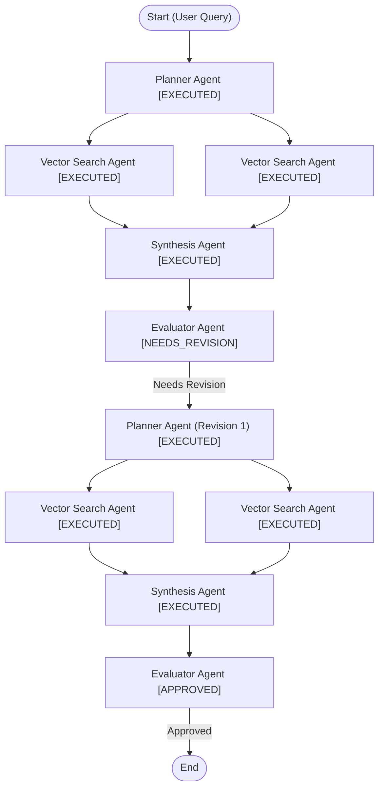

# Autonomous Multi-Agent RAG Framework

An agentic Retrieval-Augmented Generation (RAG) platform built with **LangGraph**, **FastAPI**, **PostgreSQL (`pgvector`)**, and **Nginx**. The system replaces static, single-pass search pipelines with an autonomous multi-agent state graph that plans, executes, evaluates, and self-corrects until complex domain inquiries are resolved.

---

## 1. System Vision: Standard vs. Autonomous Chatbots

### Standard Chatbots (Single-Pass RAG)

Standard RAG relies on a linear pipeline: **Query $\rightarrow$ Embed $\rightarrow$ Vector Search $\rightarrow$ LLM Synthesis**.

While effective for simple factual lookups, standard chatbots fail on multi-part, comparative, or analytical prompts. Compressing a complex prompt into a single search vector causes context dilution, resulting in hallucinated responses or context refusals.

### Autonomous Chatbots (Agentic Graph RAG)

An autonomous chatbot treats query execution as a dynamic cognitive process. Built with **LangGraph**, the framework constructs an unrolled execution graph tailored to the structure of the input question.

Instead of a single retrieval pass, an autonomous chatbot:

* Decomposes multi-part queries into specialized sub-tasks.
* Dynamically fetches chat history or executes targeted, parallel vector searches.
* Selects specific LLM runtimes (lightweight vs. high-reasoning models) based on task difficulty.
* Audits intermediate draft answers using an **Evaluator Agent**.
* Executes iterative revision loops whenever context gaps, factual errors, or incomplete reasoning are detected.

---

## 2. Core Agent Components & Capabilities

```
                  ┌──────────────────────────────────────────────┐
                  │                 Planner Agent                │
                  │  (Decomposes query, routes tasks, selects    │
                  │   models, & processes revision feedback)     │
                  └──────────────────────┬───────────────────────┘
                                         │
                 ┌───────────────────────┴───────────────────────┐
                 │                                               │
                 ▼                                               ▼
┌─────────────────────────────────┐             ┌─────────────────────────────────┐
│        Executor Nodes           │             │         Evaluator Agent         │
│  • Vector Search (Standard RAG) │             │  • Factuality & Grounding Check │
│  • History Retrieval            │             │  • Completeness Verification    │
│  • Specialized LLM Synthesis    │             │  • Statuses: APPROVED,          │
└─────────────────────────────────┘             │    NEEDS_CLARIFICATION,         │
                                                │    NEEDS_REVISION               │
                                                └─────────────────────────────────┘

```

### A. Planner Agent

The executive orchestrator of the state graph.

* **Inputs:** Raw user query, active graph state, multi-turn conversation history, and evaluation feedback from prior loops.
* **Outputs:** A structured execution blueprint defining sub-tasks, vector queries, custom prompt templates, model routing rules, and task execution order.
* **Capabilities:**
* **Query Decomposition:** Splits multi-topic queries into standalone execution steps.
* **Dynamic Model Routing:** Assigns specific model runtimes per sub-task (lightweight models for simple extractions; high-reasoning models like Gemini Pro for complex synthesis).
* **Tool & Executor Allocation:** Decides whether a task requires a vector search, dynamic history retrieval, or standard LLM reasoning.
* **Feedback Ingestion & Replanning:** Reads context gap analysis from the Evaluator during revision loops to formulate secondary search strategies.


### B. Executor Nodes

Specialized worker nodes dispatched by the Planner:

* **Vector Search Executor:** Runs similarity searches against the PostgreSQL `pgvector` store.
* **History Fetching Executor:** Pulls multi-turn chat logs from the database when conversational context is required.
* **LLM Synthesis Executor:** Processes task-specific prompts assigned by the Planner using the selected model runtime to aggregate, format, or compare context.

### C. Evaluator Agent

An autonomous quality control gate that inspects outputs before delivery.

* **Inputs:** Synthesized draft answer, original user prompt, raw retrieved context chunks, and execution step logs.
* **Outputs:** Evaluation reasoning and one of three system statuses:
1. **`APPROVED`**: The draft is factually grounded and fully answers all sub-questions. Execution finishes.
2. **`NEEDS_CLARIFICATION`**: Triggered when the user request is ambiguous. Execution halts to request user interaction.
3. **`NEEDS_REVISION`**: Triggered when the answer is incomplete or missing context. The Evaluator attaches a structured gap analysis and routes execution back to the **Planner Agent** to start a replanning loop.


---

## 3. Data & Metadata Preparation Pipeline

### Where to Place Files

Place all source documents and metadata files into the raw content directory before triggering ingestion:

```
Document_Upload_Service/
├── Raw_Content/
│   ├── metadata_batch_1.csv    <-- Metadata CSV files
│   ├── metadata_batch_2.csv
│   ├── annual_report_2025.pdf  <-- Raw PDF files
│   └── market_analysis.pdf
└── Chunks/                     <-- Generated automatically by pipeline
    ├── full_metadata.parquet
    └── master_chunks.parquet

```

### Metadata CSV Format

CSV files placed in `./Document_Upload_Service/Raw_Content` should contain metadata columns linked by `filename`:

| Column | Type | Description |
| --- | --- | --- |
| **`id`** | String / Int | Primary identifier of the document record. |
| **`filename`** | String | Exact matching PDF filename (e.g., `market_analysis.pdf`). |
| **`title`** | String | Document title. |
| **`author`** | String | Author or publishing organization. |
| **`description`** | String | Brief summary of document content. |
| **`pages`** | Int | Total page count. |
| **`file_size`** | String | File size footprint. |
| **`format`** | String | File extension (`pdf`). |
| **`category`** | String | High-level domain category. |
| **`subcategory_url`** | String | Category URL or taxonomy link. |
| **`download_url`** | String | Resource download location. |

### Ingestion & Processing Workflow

When the ingestion service executes, it carries out the following automated sequence:

```
[Raw_Content CSVs] ──► Concatenate ──► Export full_metadata.parquet ──┐
                                                                      │
[Raw_Content PDFs] ──► Extract & Chunk ──► Generate Embeddings ───────┴─► Export master_chunks.parquet
                                                                                    │
                                                                                    ▼
                                                                  Database Ingestion via COPY / Bulk Insert
                                                                                    │
                                                                                    ▼
                                                                     [PostgreSQL document_chunks]

```

1. **Metadata Consolidation:** Reads and merges all `.csv` files found in `Raw_Content`, normalizes the schema, and writes the consolidated output to `./Document_Upload_Service/Chunks/full_metadata.parquet`.
2. **PDF Chunking & Vectorization:** Reads all `.pdf` files, extracts cleaned text, splits documents using a `RecursiveCharacterTextSplitter` (2,500 char budget, 150 char overlap), and sends batches to the `embedding_service` to generate 1024-dimensional vectors.
3. **Master Chunks Export:** Saves all text chunks, filenames, chunk indices, and embedding vectors into `./Document_Upload_Service/Chunks/master_chunks.parquet`.
4. **Database Ingestion:** Merges `full_metadata.parquet` attributes with `master_chunks.parquet` chunks on `filename` and streams the enriched records directly into the PostgreSQL `document_chunks` table.

### Target Database Schema

```sql
CREATE TABLE document_chunks (
    id SERIAL PRIMARY KEY,
    document_id VARCHAR(255) NOT NULL,
    filename VARCHAR(255) NOT NULL,
    chunk_index INT NOT NULL,
    content TEXT NOT NULL,
    embedding vector(1024),
    metadata JSONB DEFAULT '{}'::jsonb,
    "_insertionTimestamp" TIMESTAMPTZ DEFAULT NOW()
);

```

---

## 4. Dynamic Execution Graph & Revision Loop

### Benchmark Query Example

> *"Analyze the impact of migrant remittances on domestic exchange rate volatility and evaluate how central banks use foreign exchange intervention strategies to stabilize local currency reserves."*

### Dynamic Graph Topology



### Execution Breakdown

1. **Initial Planning (`planner_p1`):** The Planner decomposes the prompt into two parallel sub-tasks (`task_p1_0` for remittance volatility and `task_p1_1` for FX intervention strategies).
2. **Parallel Retrieval & Draft Synthesis (`task_p1_2`):** Executors pull relevant document vectors and generate an initial draft report.
3. **Quality Check (`evaluator_p1`):** The Evaluator detects that specific central bank foreign exchange reserve accumulation rules were missed. It sets the state to **`NEEDS_REVISION`** with actionable gap notes.
4. **Replanning (`planner_p2`):** The Planner ingests the feedback and generates secondary targeted tasks (`task_p2_0` and `task_p2_1`) specifically searching for reserve management mechanics.
5. **Final Synthesis & Approval (`evaluator_p2`):** Context is merged, verified, marked **`APPROVED`**, and returned to the user alongside the unrolled Mermaid graph topology.

---

## 5. Microservices Architecture & Technology Stack

The platform runs as six containerized microservices:

* **`ui_service`** (Nginx): Serves the web UI and renders interactive execution graphs.
* **`graph_service`** (LangGraph / FastAPI): Manages the dynamic multi-agent DAG execution, state transitions, and endpoint `/process`.
* **`doc_upload_service`** (FastAPI / PyPDF / Pandas): Handles PDF text extraction, metadata aggregation, Parquet file exports, and database ingestion.
* **`embedding_service`** (PyTorch / FastAPI / Hugging Face Transformers): Computes dense vector representations with local model caching.
* **`db_api`** (FastAPI / SQLAlchemy / AsyncPG): Exposes endpoints for vector similarity searches and chat history persistence.
* **`database_pgvector`** (PostgreSQL 16 / `pgvector`): Stores document chunks, JSONB metadata, HNSW vector indices, and chat logs.

---

## 6. System Trade-Offs & Future Enhancements

### Latency vs. Thoroughness

* **Standard RAG Latency:** ~2 to 5 seconds (Fast, but low detail and prone to context drops).
* **Autonomous RAG Latency:** ~20 to 30 seconds (Slower, but delivers thorough, multi-page verified analysis).

### Proposed Enhancement: Intent Router

To optimize performance, an **Intent Classification Router** can be placed at the system entry point:

```
                           ┌────────────────────────┐
                           │    Incoming Query      │
                           └───────────┬────────────┘
                                       │
                                       ▼
                           ┌────────────────────────┐
                           │   Intent Classifier    │
                           └───────────┬────────────┘
                                       │
            ┌──────────────────────────┴──────────────────────────┐
            │                                                     │
            ▼                                                     ▼
┌───────────────────────┐                             ┌───────────────────────┐
│  Direct Lookup Query  │                             │  Analytical Query     │
├───────────────────────┤                             ├───────────────────────┤
│ Routed to:            │                             │ Routed to:            │
│ Fast Standard RAG     │                             │ Autonomous Agent RAG  │
│ (Sub-2s Latency)      │                             │ (Iterative Loops)     │
└───────────────────────┘                             └───────────────────────┘

```

Factual lookups route to Standard RAG for sub-2 second responses, while complex inquiries trigger Autonomous Agent RAG for multi-step reasoning.

---

## 7. Setup & Deployment Guide

### Environment Configuration

Create a `.env` file in the root project directory:

```env
# PostgreSQL Credentials
POSTGRES_DB=your_db_name
POSTGRES_USER=your_db_user
POSTGRES_PASSWORD=your_secure_password

# Model Authentication (Choose Vertex AI or Direct Gemini API)
GEMINI_API_KEY=your_gemini_api_key

# Optional (Required only if using GCP Vertex AI instead of Direct API)
GOOGLE_CLOUD_PROJECT=your-gcp-project-id
GOOGLE_CLOUD_LOCATION=us-central1
GOOGLE_APPLICATION_CREDENTIALS=/path/to/your-gcp-key.json

```

### Deployment Steps

1. **Place Raw Data Files:**
Copy PDF files and metadata CSVs into `./Document_Upload_Service/Raw_Content`.
2. **Launch Infrastructure:**
```bash
docker compose up --build -d

```


3. **Trigger Ingestion Pipeline:**
```bash
curl -X POST http://localhost:8002/ingest-all

```
